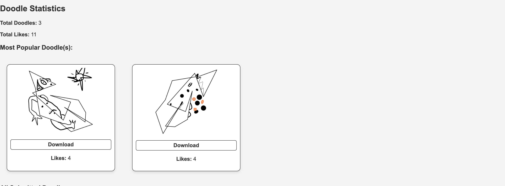

# Concept - Inspire Your Artistry

**Author**: Annelaure van Overbeeke

Concept is a web application designed to inspire creativity by allowing users to explore, save, and share artistic ideas. This includes daily challenges, a gallery of user submissions, and organizational tools for creative projects.

---

<h2 align="center">Table of Contents</h2>

- [Introduction](#introduction)
- [Features](#features)
- [Installation](#installation)
- [API Usage](#api-usage)
- [Demonstration video](#demonstration-video)
- [Screenshots](#screenshots)
- [Project Structure](#project-structure)
- [Acknowledgments](#acknowledgments)

---

<h2>Introduction</h2>

Concept is a web application designed to foster creativity and inspiration. Whether you're a professional artist, a hobbyist, or just looking for some creative fun, Concept offers tools to save and share your ideas while connecting with a community of like-minded.

---

<h2 align="center">Features</h2>

### **1. Creative Organization**
- Store and organize inspirations such as images, artworks, and recipes.
- Create collections or mood boards for your creative projects.

### **2. Daily Doodle Challenge**
- Generate a random scribble each day to inspire your creative mind.
- Draw over the scribble, submit your creation, and gain likes.
- Compete on daily leaderboards to showcase your creativity.

### **3. Community Interaction**
- Browse and like submissions from other users.
- Gain inspiration from the shared gallery.

### **4. Public API**
- Access the doodle database from Concept using the public API.
- Retrieve information about submissions, likes, and users to create your own integrations.

---

<h2 align="center">Installation</h2>

### Prerequisites
- Python 3.10+
- PostgreSQL

### Installation Steps

1. **Clone the repository:**
   ```bash
   git clone https://github.com/Annelaurevov/Concept.git
   cd concept
   ```

2. **Install dependencies:**
   ```bash
   pip install -r requirements.txt
   ```

3. **Create a `.env` file with the following:**
   ```env
   DATABASE_URL=postgresql://<user>:<password>@localhost/<database>
   SECRET_KEY=your-secret-key
   ```

4. **Initialize the database:**
   ```bash
   flask db upgrade
   ```

5. **Start the application:**
   ```bash
   flask run --debug
   ```

6. **Access the application:** Open your browser and go to `http://127.0.0.1:5000`.

---

<h2 align="center">API Usage</h2>

### API Endpoints
- **`GET /api/doodles/filter`**: Retrieve all doodles.
- **`GET /api/doodles/filter?date=YYYY-MM-DD`**: Get doodles for a specific date.

### Example Request
```bash

curl -H "x-api-key: mijn-doodles" "http://127.0.0.1:5000/api/doodles/filter?=2024-12-16"
```

---

<h2 align="center">Demonstration video</h2>

You can watch the demo of this project here: 
[Demo Video](https://www.youtube.com/watch?v=zMnwWoNiVvw)

<h2 align="center">Screenshots</h2>

### **Homepage**


### **Recipe page**


### **Favorite art page**


### **Doodle Challenge**




---

<h2 align="center">Project Structure</h2>

- **`app.py`**: All used routes.
- **`models.py`**: Database models for users, doodles, and saved items.
- **`scribble.py`**: Logic for generating the daily doodles.
- **`static/`**: Static assets like CSS and images.
- **`templates/`**: All HTML templates.

---
<h2 align="center">Acknowledgments</h2>

This project was created with inspiration from tools like Google Doodle and community-driven platforms. Special thanks to the following resources, tools, and individuals for their guidance, support, and contributions:

- **The Minor Programming Community**: A thank you to all the students, instructors, and mentors who provided support and feedback throughout the minor. 
- **Brian Yu and David Malan**: Materials from Harvard's CSCI S-33a course, published under a Creative Commons Attribution-Noncommercial-Share Alike 3.0 Unported license.  
- **David Malan**: CS164 course materials from Harvard, published under a Creative Commons Attribution-Noncommercial-Share Alike 3.0 Unported license.  
- **Edamam API**: For providing recipe data and helping inspire the food-related functionalities of this project.  
- **Unsplash API**: For providing beautiful, free photos and enhancing the visual experience of this project.  
- **Rijksmuseum API**: For enabling access to incredible artworks and cultural content.  
- **YouTube Tutorials**: A big thank you to all the creators who published valuable coding tutorials that guided me through the challenging parts of this project.  

A sincere thank you to everyone and every tool that contributed to this project. Your work has been an essential source of knowledge, creativity, and problem-solving.

---

Concept is a project fueled by passion for creativity. Share your art, explore new ideas, and inspire others!

